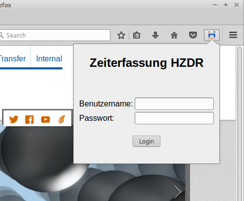
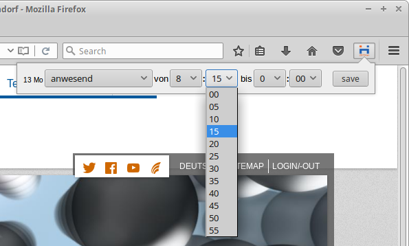
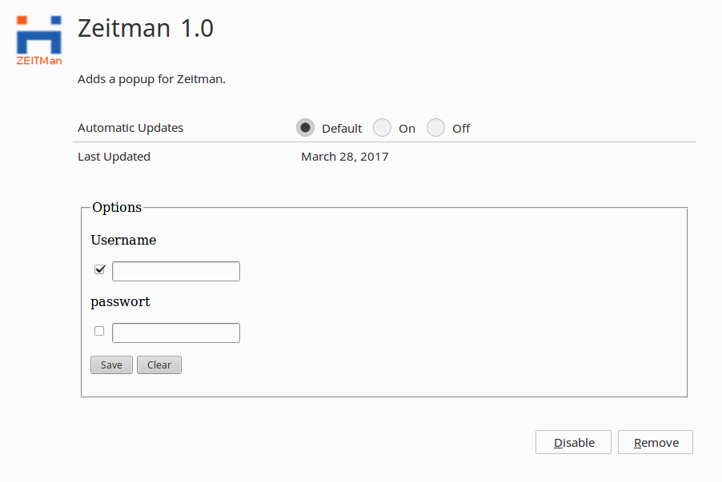

# hzdr-web-ext-zeitman

small web-extension to handle the hzdr zeitman website in a popup by showing only the relevant day.

Supports User and Password saving. Merge requests welcome!

Install non signed xpi in firefox (Developer, Nightly, and pre 48):

1. open new tab
2. type about:config
3. toggle xpinstall.signatures.required to false
4. goto about:addons
5. install addon from file

